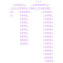

## Hi there 👋, I am Davi

- 🔭 I’m currently working on University Projects and on my primary account projects. Checkout the primary account at [github.com/d4v1-sudo](https://github.com/d4v1-sudo)

### A little more about me...

- 👨‍💻 I’m currently an Undergraduate Computer Engineering student at PUC Campinas.

- 🚀 I’m proactive and highly engaged, always striving to create innovative solutions that deliver positive impact and improve processes.

- 💻 My passions include Python, Web Development, Arduino projects, Automations, Data Analysis, and Machine Learning.

- 🎓 I’m constantly seeking new knowledge and sharpening my skills to stay ahead in technology and innovation.

- Hobbies? I love solving problems.

> **Always learning, because intellectual growth should commence at birth and cease only at death. The important thing is not to stop questioning.**
---
Primary Account Data:
---

---
Secondary Account Data:
---

### Skills & Tools:

<!-- Linguagens de Programação -->

  <h3>Languages</h3>
   
   
   
   
   
   
  
  ASM

<!-- Frameworks & Bibliotecas -->

  <h3>Frameworks & Libraries</h3>
   
  
  
  
  
  
  
  
  

<!-- Ferramentas & DevOps -->

  <h3>Tools & DevOps</h3>
  
   
  
  
  
  

<!-- Sistemas Operacionais -->

  <h3>Operating Systems</h3>
   
   
   
   
   

<!-- IA & Data Science

  <h3>IA & Data Science</h3>
  
  

 -->

<!-- Hardware -->

  <h3>Hardware</h3>
  

<!-- Softwares -->

  <h3>Softwares</h3>
  
  

📫 How to reach me:

  

  

<!--
### Areas of Study & Interest:

Development: [YOUR DEVELOPMENT SKILLS HERE]

Infrastructure/Operations: [YOUR INFRASTRUCTURE/OPS SKILLS HERE]

Emerging Technologies: [YOUR EMERGING TECH SKILLS HERE]

Other: [YOUR OTHER SKILLS/INTERESTS HERE]

### 🏆 Certifications & Achievements:

[YOUR CERTIFICATIONS AND ACHIEVEMENTS HERE]

-->
